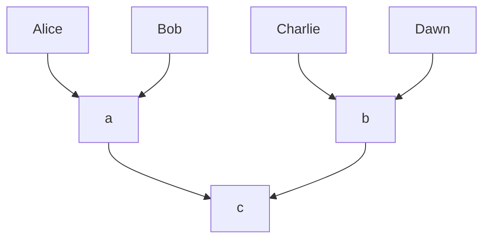

# Phylourny

Phylourny is a toy project to apply a modified version of Felsenstein's pruning
algorithm to predicting tournament, such as football or basketball tournaments.
The big advantage of doing this, over just running simulations, is that we
obtain higher fidelity estimations with less effort. 

# The Algorithm

As stated before the algorithm used in Phylourny is a modified version of
Felsenstein's pruning algorithm for evaluating the likelihood of a tree and a
model given some data. As pointed out by Zhang in his book _Computational
Molecular Evolution_ this algorithm is itself a version of a method from the
early Chinese mathematics to evaluate polynomials faster. We use this to
enumerate the paths a team can take through the tournament in a quicker fashion
than brute force enumeration.

It is probably important to note that this problem is unlikely to get to the
size that this is needed. Most tournaments in the world are small, and are
perfectly capable of being sampled, or of enumerating the paths explicitly.

# Downloading and Building

To download Phylourny, use the command

```
git clone --recursive https://github.com/computations/phylourny
```

and to build

```
make
```

The resulting binaries will be placed in `bin`. Depending on the packages installed locally, there might be 3 binaries:

- `phylourny`: The main binary.
- `phylourny_test`: The test suite.
- `phylourny_bench`: The benchmarking suite.

For most people, only the main binary will be interesting. The test binary will be useful if one needs to check the code
does actually work, but the benchmarking binary contains a lot of "extra" benchmarks that are not _really_ that relevant
to the program.

The test suite will be built if CMake detects that the address sanitizer is available with the compiler used, and if the
option `PHYLOURNY_BUILD_TESTS` is set, which it is by default. To disable building tests, set the option
`PHYLOURNY_BUILD_TESTS` to `OFF`. 

Benchmarks will be built if the flag `PHYLOURNY_BUILD_BENCH` is set on, which it is by default. To disable building the
benchmark suite, set `PHYLOURNY_BUILD_BENCH` to `OFF`.

# Examples

There are example datasets in the `experiments` directory. These are a good
place to start if you want to start using the tool.

# How to run

To run phylourny, at least 2 files are needed. The first is a file describing
the tournament structure, which looks like

```csv
Alice
Bob
Charlie
Dawn
```

This gives a tournament structure 



At the moment, we only support balanced single elimination tournaments. By
balanced, we mean that all teams need to pass through the same number of levels
to win, and that each match (except the first) is determined by the winners of
two lower level matches. Single elimination in this context means that once a
team looses a match, they are out of the tournament. Alternatively, there is
only one path from the bottom to the top of the tournament.

The second file that is required is the data file. This file take the form of
odds, probabilities or match history. However, a typical run of phylourny uses
matches. A match file is like

```csv
team1, team2, team1-goals, team2-goals
Alice, Bob, 1, 2
Alice, Charlie, 1, 2
...
```

With these files, the command to generate a list of samples is 

```
./phylourny --teams teams.csv --matches matches.csv --samples 10000 --prefix results
```

which will generate everything and place the results in a set of files labeled
`results`. To visualize these results, please use the scrips in `util`.

For more information about program options, please run `phylourny --help`.

## Run modes

There are 3 run modes for `phylourny`: dynamic, single and simulation. 

- **Dynamic** is the default run mode, where Horner's method is used to
  accelerate computation.
- **Single** is an alternative to dynamic which will explicitly evaluate every
  possibility, in the slow way. This really only should be used for _small_
  multi-elimination tournaments.
- **Simulation** mode will compute the results approximately using simulations.
  That is, it will run the tournament stochastically a number of times, and use
  that to approximate the true WPV. The number of simulations used to
  approximate the WPV can be controlled with the option `--sim-iters`. This mode
  should only be used for multi-elimination tournaments.

## Threading

By default, `phylourny` will spawn a number of threads equal to the number of
_logical_ cores available on the system. If you want to run `phylourny` with
fewer threads, run the program as

```
OMP_NUM_THREADS=<THREAD COUNT> ./phylourny ...
```
